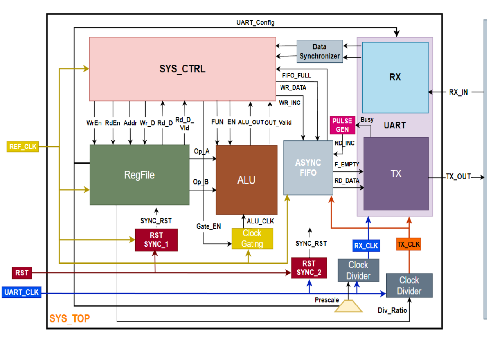

# UART-Based Master-Slave System Controller

A multi-clock-domain digital system that receives commands over UART, executes them on a register file or a signed ALU, and sends the result back over UART. The design is taken through the complete RTL-to-DFT flow on a TSMC 0.13 µm standard-cell library: lint, CDC/RDC sign-off, synthesis, scan insertion, and formal equivalence checking after each netlist transformation.

| | |
|---|---|
| **Clocks** | `REF_CLK` 50 MHz, `UART_CLK` 3.6864 MHz (asynchronous to each other) |
| **Default UART** | 115200 baud, 8 data bits, even parity enabled, 1 stop bit |
| **Technology** | TSMC 0.13 µm (`scmetro_tsmc_cl013g`, RVT), SS / TT / FF corners |
| **Flow** | ModelSim/Questa, SpyGlass, Design Compiler (O-2018.06-SP1), Formality |

---

## Contents

1. [System overview](#system-overview)
2. [Command protocol](#command-protocol)
3. [Register file map](#register-file-map)
4. [ALU function encoding](#alu-function-encoding)
5. [Design details](#design-details)
6. [Verification](#verification)
7. [Implementation flow and results](#implementation-flow-and-results)
8. [Repository structure](#repository-structure)
9. [Running the flow](#running-the-flow)

---

## System overview

A master (the testbench) sends command frames over `RX_IN`. The UART receiver deserializes each frame in the `UART_CLK` domain, a data synchronizer moves the byte into the `REF_CLK` domain, and the system controller decodes the command and drives either the register file or the ALU. Results are pushed into an asynchronous FIFO and transmitted back on `TX_OUT`.



*Figure: `SYS_TOP` block diagram. Clock paths are colored by domain; `RX_CLK` and `TX_CLK` come from the two clock dividers.*

Signal names in the figure map to the RTL as follows:

| Figure label | RTL signal | Figure label | RTL signal |
|---|---|---|---|
| `UART_Config` | `REG2` (`UART_CONFIG`) | `Gate_EN` | `CLK_en` |
| `Prescale` | `REG2[7:2]` | `FUN` | `ALU_FUNC` |
| `Div_Ratio` | `REG3` (`TX_DIV_Ratio`) | `EN` | decoded inside the ALU from `ALU_FUNC[3:2]` (no separate port) |
| `Wr_D` / `Rd_D` | `WR_Data` / `RD_Data` | `FIFO_FULL` | `W_full` |
| `Rd_D_Vld` | `RD_Valid` | `WR_INC` / `WR_DATA` | `W_inc` / `WR_DATA_fifo` |
| `SYNC_RST` | `RST_Domain_1` / `RST_Domain_2` | `RD_INC` / `F_EMPTY` | `R_inc` / `R_empty` |
| `Busy` | `busy` (UART TX) | `RD_DATA` | `TX_P_data` |

Ten blocks, grouped as in the specification:

| Group | Blocks |
|---|---|
| Clock domain 1 (`REF_CLK`) | Register File, ALU, Clock Gating, System Controller |
| Clock domain 2 (`UART_CLK`) | UART TX, UART RX, Pulse Generator, Clock Dividers |
| Synchronizers | Reset Synchronizer (one per domain), Data Synchronizer, Asynchronous FIFO |

---

## Command protocol

Every frame is a single UART byte. The first frame of a command selects the operation.

| Command | Opcode | Frames | Layout (in order sent) | Response |
|---|---|---|---|---|
| Register file write | `0xAA` | 3 | `0xAA`, address, data | none |
| Register file read | `0xBB` | 2 | `0xBB`, address | 1 byte (register value) |
| ALU operation with operands | `0xCC` | 4 | `0xCC`, operand A, operand B, ALU_FUN | 2 bytes (result low byte, then high byte) |
| ALU operation without operands | `0xDD` | 2 | `0xDD`, ALU_FUN | 2 bytes (result low byte, then high byte) |

`0xCC` writes operands A and B into registers `0x0` and `0x1`. `0xDD` reuses whatever is already in those registers.

**UART frame format:** start bit (0), 8 data bits LSB first, optional parity bit, stop bit (1). Parity is enabled by default; the parity bit is `^data ^ PAR_TYPE`, so `PAR_TYPE = 0` gives even parity.

**Typical sequence:** write the configuration registers (`0x2`, `0x3`), then issue register and ALU commands.

---

## Register file map

16 registers, 8 bits each. Addresses `0x0` to `0x3` are reserved; `0x4` and above are general purpose.

| Address | Name | Function | Reset value |
|---|---|---|---|
| `0x0` | REG0 | ALU operand A | `0x00` |
| `0x1` | REG1 | ALU operand B | `0x00` |
| `0x2` | REG2 | UART config: `[0]` parity enable, `[1]` parity type, `[7:2]` prescale | `0x81` (parity on, even, prescale 32) |
| `0x3` | REG3 | TX clock division ratio | `0x20` (32) |
| `0x4`+ | | General-purpose storage | `0x00` |

**Clocking relationship.** The prescale value in `REG2[7:2]` is the RX oversampling factor and selects the RX clock divider through `Prescale_MUX` (32 maps to /1, 16 to /2, 8 to /4, 4 to /8). The TX clock is `UART_CLK / REG3`. With the defaults, `RX_CLK` runs at 3.6864 MHz (32x oversampling) and `TX_CLK` at 115.2 kHz, which gives 115200 baud.

---

## ALU function encoding

`ALU_FUN[3:2]` selects the unit and `ALU_FUN[1:0]` selects the operation. Arithmetic is signed. The result is 16 bits wide.

| `ALU_FUN` | Operation | `ALU_FUN` | Operation |
|---|---|---|---|
| `0000` | A + B | `1000` | NOP (output 0) |
| `0001` | A - B | `1001` | A == B (1 if equal) |
| `0010` | A x B | `1010` | A > B (2 if true) |
| `0011` | A / B (0 when B = 0) | `1011` | A < B (3 if true) |
| `0100` | A AND B | `1100` | A >> 1 |
| `0101` | A OR B | `1101` | A << 1 |
| `0110` | A NAND B | `1110` | B >> 1 |
| `0111` | A NOR B | `1111` | B << 1 |

---

## Design details

**UART TX.** An FSM (Idle, Start, Data, Parity, Stop) drives a 4-way output mux selecting start bit, serialized data, parity bit, or stop bit. A serializer shifts the byte out LSB first and raises `ser_done`; a parity calculator produces the parity bit when data is loaded. The `busy` flag is turned into a one-cycle pulse by the Pulse Generator to pop the next byte from the FIFO.

**UART RX.** An FSM (Idle, Start, Data, Parity, Stop) works with an edge/bit counter that counts oversampling edges per bit. The data sampler takes three samples around the middle of each bit and applies a majority vote. Dedicated checkers flag start, parity, and stop errors; `PAR_err` and `STOP_err` are exposed at the top level. Back-to-back frames are handled by jumping from Stop straight to Start when the line is already low.

**System controller.** A 12-state FSM decodes the opcode and sequences address and data frames. It latches the register address and ALU function across frames, enables the ALU clock only while an operation is in flight, holds in `ALU_WAIT` until `ALU_Valid`, and pushes the two result bytes into the FIFO, waiting whenever `W_full` is asserted.

**Clock gating.** A latch-based gate (`CLK_en` is captured while `clk` is low, then ANDed with `clk`) removes glitches and stops the ALU clock when idle.

**Clock dividers.** Programmable divider with bypass for ratios 0 and 1, enabled permanently (`i_clk_en = 1`) as specified. One instance feeds RX, one feeds TX.

**Clock domain crossing.**

| Crossing | Mechanism |
|---|---|
| Reset, both domains | Two-stage reset synchronizer (async assert, sync de-assert) |
| RX byte to `REF_CLK` | `Data_Sync`: multi-stage enable synchronizer (default 8 stages), rising-edge pulse, bus sampled on the pulse |
| `REF_CLK` to `TX_CLK` (results) | Asynchronous FIFO, 8 entries, Gray-coded pointers, two-flop pointer synchronizers (`DF_SYNC`) |
| TX busy to FIFO read | Pulse Generator in the TX domain |
| Config registers to clock dividers | Quasi-static, recognized by SpyGlass as not needing synchronization |

---

## Verification

Testbenches live in `Testbenches/`, one folder per block, each with a `wave.do` where applicable:

`System Top`, `UART_TOP`, `UART_RX`, `UART_TX`, `System Controller`, `Signed ALU`, `Register File`, `Asynchronous FIFO`, `Data Synchronizer`, `Reset Synchronizer`, `Clock Divider`, `Clock Gating`.

The top-level testbench (`System_TOP_tb.v`) is self-checking and follows the sequence required by the specification: configure registers `0x2` and `0x3`, then issue register-file and ALU commands as the master. It provides tasks for register write/read and for ALU operations with and without operands. It checks register contents, ALU results, the TX parity and stop bits, that `PAR_err` and `STOP_err` stay low, and that the controller reaches the expected state. It ends with `ALL TESTS PASSED` or `TEST FAILED`, and includes a watchdog.

To run in ModelSim/Questa, fill in the module and wave-file names in `Testbenches/run.do.txt` and execute it. It compiles the files listed in `Testbenches/sourcefile.txt`.

---

## Implementation flow and results

Flow: **RTL, then lint and CDC (SpyGlass), then synthesis (Design Compiler), then DFT scan insertion, with Formality equivalence checks after synthesis and after DFT.**

Synthesis constraints: `REF_CLK` 20 ns, `UART_CLK` 271.27 ns, setup uncertainty 0.2 ns, hold uncertainty 0.1 ns, input and output delays at 20% of the clock period. `REF_CLK`/`ALU_CLK` and `UART_CLK`/`RX_CLK`/`TX_CLK` are declared asynchronous clock groups. Generated clocks: `ALU_CLK` (gated), `RX_CLK` (/1), `TX_CLK` (/32).

### Lint and CDC / RDC (SpyGlass)

| Check | Result |
|---|---|
| Lint (RTL) | 3 messages, 1 waived; the others are informational |
| CDC verify | 52 messages, 6 waived; no Error or Warning severity |
| CDC verify (structural) | 46 messages, 3 waived |
| Unsynchronized scalar / vector crossings | **0 / 0** |
| Synchronized scalar / vector crossings | 7 / 15 |
| Glitches on synchronized control paths | 0 |
| Data loss on fast-to-slow control crossings | 0 |
| Resets with reset synchronizers / without | 2 / 0 |
| Reset domain crossings (RDC) | 0 |

Reports for setup check, clock/reset integrity, abstract view, and RDC are included alongside.

### Synthesis (Design Compiler)

| Metric | Value |
|---|---|
| Total cell area | 25,680 µm² |
| Combinational / non-combinational area | 16,290 / 9,390 µm² |
| Cells | 2,282 (1,857 combinational, 410 buffers/inverters) |
| Total power (SS, 1.08 V, 125 C) | 0.363 mW (switching 0.111, internal 0.234, leakage 0.017) |
| Constraint violations | none |

Timing (all paths met):

| Clock group | Setup slack | Hold slack |
|---|---|---|
| `ALU_CLK` (50 MHz) | 0.05 ns | 1.38 ns |
| `REF_CLK` (50 MHz) | 6.96 ns | 0.52 ns |
| `UART_CLK` / `RX_CLK` (3.6864 MHz) | 265.97 / 261.39 ns | 0.52 / 1.19 ns |
| `TX_CLK` (115.2 kHz) | 8671.88 ns | 0.61 ns |

The critical path is register file to ALU on the gated clock. Power figures use propagated switching activity, not simulation-annotated activity.

### DFT (scan insertion)

| Metric | Value |
|---|---|
| Scan style | Full scan, multiplexed flip-flop |
| Scan chains | 4 (92 / 91 / 91 / 91 cells), 365 scan cells |
| Scan ports | `SI[2:0]`, `SO[2:0]`, `SE`, `test_mode`, `scan_clk`, `scan_rst` |
| **Estimated test coverage** | **99.47%** |
| DRC | 1 warning (TEST-505) on the clock-gating latch, whose enable is forced on in test mode; the other 365 sequential cells are valid scan cells |
| Area after scan | 30,772 µm² (+19.8% over synthesis) |
| Power after scan | 0.518 mW |

Clock and reset muxing for test mode is built into `System_TOP_DFT.v`.

### Formal equivalence (Formality)

| Comparison | Compare points | Passing | Failing | Aborted / unverified | Result |
|---|---|---|---|---|---|
| RTL vs. post-synthesis netlist | 369 | 369 | 0 | 0 | **Verification SUCCEEDED** |
| post-DFT insertion RTL vs. post-DFT netlist | 369 | 369 | 0 | 0 | **Verification SUCCEEDED** |

Compare points: 3 ports, 365 flip-flops, 1 latch (the clock-gating latch).

---

## Repository structure

```
.
├── RTL/                          Source, one folder per block
│   ├── System Top/               System_TOP.v
│   ├── System Controller/        System_Controller.v
│   ├── Register File/            register_file.v
│   ├── Signed ALU/               alu_top, arithmetic/logic/cmp/shift units, decoder
│   ├── UART_TOP/                 UART_TOP.v (TX + RX wrapper)
│   ├── UART_TX/                  FSM, MUX, Serializer, Parity_Calculator, UART_TX_top
│   ├── UART_RX/                  FSM_RX, Edge_Bit_Counter, Data_Sampler, Deserializer,
│   │                             Start/Parity/Stop checkers, UART_RX_top
│   ├── Asynchronous FIFO/        ASYC_FIFO, FIFO_WR, FIFO_RD, FIFO_MEM_CONTROL, DF_SYNC
│   ├── Clock Divider/            Clock_Divider.v
│   ├── Clock Gating/             Clock_Gating.v
│   ├── Prescale MUX/             Prescale_MUX.v
│   ├── Pulse Generator/          Pulse_Generator.v
│   ├── Data Synchronizer/        Data_Sync.v
│   └── Reset Synchronizer/       Reset_SYNC.v
├── Testbenches/                  Per-block and top-level testbenches, wave.do files, run.do.txt
├── Linting & CDC/
│   ├── LINT/                     RTL lint reports
│   └── CDC/                      CDC, RDC, setup, clock/reset integrity, abstract views
├── Synthesis/syn/                Design Compiler scripts, constraints, netlist, SDC/SDF, reports
├── Design For Test (DFT)/        Scan insertion script, scan netlist, SDC/SDF, reports
├── Formality Post Synthesis/     RTL vs. synthesized netlist
└── Formality Post DFT/           Synthesized vs. scan netlist
```

---

## Running the flow

Each implementation stage has its own launcher and Tcl script.

| Stage | Command |
|---|---|
| Simulation | `vsim -do run.do` from `Testbenches/` (after editing `run.do.txt` for your testbench) |
| Synthesis | `cd Synthesis/syn && ./run_syn.sh` |
| DFT | `cd "Design For Test (DFT)" && ./run_dft.sh` |
| Formality (post-synthesis) | `cd "Formality Post Synthesis" && ./run_syn_fm.sh` |
| Formality (post-DFT) | `cd "Formality Post DFT" && ./run_dft_fm.sh` |
| CDC / lint | Open `Linting & CDC/CDC/Final_System_CDC.prj` in SpyGlass |

The scripts reference the standard-cell libraries under `/home/ICer/Final_System/std_cells/`; adjust `search_path` in the Tcl scripts for your environment.

---

## Author

Mohamed Aboualy, Electronics and Electrical Communications Engineering, Cairo University. [github.com/mo-aboualy](https://github.com/mo-aboualy)